= ESP8266-12S Wi-Fi Sensor IoT Workshop
:toc:
In this hands-on workshop, we will learn how to program the WeMos ESP8266-12S D1 mini board using the Arduino IDE to upload the code to the board. We will start a few practical exercises and finish up by connecting the ESP8266 to the container-based metrics system, using ElasticSearch (as the data store) with Kibana (for dashboard and metrics visualization) deployed in the Oracle Container Cloud Services.

== Requirements
* Micro Controller: WeMos ESP-8266-12S D1 mini v.2.3.0 or WeMos ESP-8266EX D1 mini v3.0.0 4MB flash. https://wiki.wemos.cc/products:d1:d1_mini[Product page].

image::images/wemos/d1_mini.jpg[]
* Display Shield: WeMos OLED Shield v1.1.0 or WeMos OLED Shield v2.0.0. https://wiki.wemos.cc/products:d1_mini_shields:oled_shield[Product page].

image::images/wemos/oled.jpg[]
* Temperature Humidity Sensor: WeMos SHT30 Shield v1.0.0 I^2^C or Wemos SHT30 Shield v2.0.0. https://wiki.wemos.cc/products:d1_mini_shields:sht30_shield[Product page].

image::images/wemos/sht30.jpg[]
* WeMos Dual Base. https://wiki.wemos.cc/products:d1_mini_shields:dual_base[Product page].

image::images/wemos/dual-base.jpg[]

* Arduino IDE
* Docker
* USB-type B mini cable

[IMPORTANT]
====
For Windows and Mac OS X users, you may need to install the https://wiki.WeMos.cc/downloads[CH340G] driver.
Install the driver without having the board connected.
====

[IMPORTANT]
====
After installing the driver for windoes check the Device Manager, and *look up which COM port* the driver has created. This COM port, for instance COM3, COM4, COM... is the one that will neeed to be selected when you want to upload programs to the board. More information at http://www.arduined.eu/ch340-windows-8-driver-download/[arduined.eu]
====

== The ESP-8266-12S

The ESP8266 is the name of a micro controller designed by Espressif Systems.
Espressif is a Chinese company based in Shanghai. The ESP8266 is a self-contained Wi-Fi networking solution, acting as a bridge from existing micro controller to the Wi-Fi, and is also capable of running self-contained applications.

Volume production of the ESP8266 didn't start until the beginning of 2014 which means
that, in the scheme of things, this is a brand new entry in the line-up of processors. In our technology-hungry world, new often equates to interesting. A couple of years after IC production, 3rd party OEMs are taking these chips and building "breakout boards" for them. If I were to hand you a raw ESP8266 straight from the factory, it is unlikely you would know what to do with one. They are very tiny and virtually impossible for hobbyists to attach wires to allow them to be plugged into breadboards. Thankfully, these OEMs bulk purchase the ICs, design basic circuits, design printed circuit boards and construct pre-made boards with the ICs pre-attached immediately ready for our use. It is these boards that capture our interest and that we can buy for a few dollars on eBay.

There are a variety of board styles available. The two that I am going to focus on have been given the names ESP-1 and ESP-12. It is important to note that there is only one ESP8266 processor and it is this processor that is found on ALL breakout boards. What distinguishes one board from another is the number of GPIO pins exposed, the amount of flash memory provided, the style of connector pins and various other considerations related to construction. From a programming perspective, they are all the same.

=== The ESP8266 specification

When looking at a new electronics device, it's a good idea to look at its specification.
Here are some of the key points:

[width="100%"]
|====================
| Voltage | 3.3V
| Current consumption | 10uA – 170mA
| Flash memory attachable | 16MB max (512K normal) 
| Processor | Tensilica L106 32 bit 
| Processor speed | 80-160MHz 
| RAM | 32K + 80K 
| GPIOs | 17 (multiplexed with other functions)
| Analog to Digital | 1 input with 1024 step (10 bit) resolution
| 802.11 support | b/g/n/d/e/i/k/r 
| Maximum concurrent TCP connections | 5
|====================

The question of determining how long an ESP8266 can run on batteries is an interesting
one. The current consumption is far from constant. When transmitting at full power, it
can consume 170mA but when in a deep sleep, it only needs 10uA. That is quite a
difference. This means that the runtime of an ESP8266 on a fixed current reservoir is
not just a function of time but also of what it is doing during that time... and that is a
function of the program deployed upon it.

The ESP8266 is designed to be used with a partner memory module and this is most
commonly flash memory. Most modules come with some flash associated with
them. Flash has a finite number of erases per page before something fails.
They are rated at about 10,000 erases. This is not normally an issue for configuration
change writes or daily log writes ... but if your application is continually writing new data
extremely fast, then this may be an issue and your flash memory will fail.

=== Acknowlegment
The current section is a small extract from the awesome book about ESP-8266 _Kolban's Book on ESP-8266_ and ESP-32 _Kolban's Book on ESP-32_ written by Neil Kolban. Although the book can be obtained for free, consider supporting the awesome job he did by buying the book.

== Arduino IDE Pre-built Portable Edition

For this workshop, we have also prepared a portable Arduino IDE edition containing all the libraries, hardware packages (cores), and sketches with the final solutions.

This portable edition is the same base edition, plus a folder called _portable_ provided by us:

. Download from https://www.arduino.cc/en/Main/Software[here] the Arduino IDE for your operation system.
. Copy and extact the *portable* archive according to your operating system at root folder of your Arduino IDE installation:

* For windows copy and extract portable_windows.zip
* For Linux or MacOSX copy and extract portable.zip

[CAUTION]
====
Copy/extract the entire portable forlder(not the content of the folder) to the root folder of your Arduino IDE installation.
====

[IMPORTANT]
====
Start Arduino IDE with Admin rights.
====

=== The Basics of Arduino IDE
Although Arduino offers multiple functionalities and options, the most commonly used actions are (from left to right):

* Compile sketch: the _tick_ icon.
* Compile and upload to the board: the right arrow.
* Tools menu:
** Serial Monitor: Output console that displays everything you write to the Serial Port.
** Board: Menu that allows you to select the board to which the compiled sketch will be uploaded.
** Port: Select the port to which the board is connected.

==== Manual installation
.Arduino
Download from https://www.arduino.cc/en/Main/Software[here] the Arduino IDE for your operation system.

.WeMos ESP8266 Board Harware Packages
After downloading and installing the Arduino IDE, install the required hardware packages to work with the WeMos ESP-82-12S D1 mini board.

There are two ways to install this board:

. using https://git-scm.com/[git], or
. using the official support for adding third-party boards to new board manager.

===== 1. Installing the board using Git
Clone the repository into the following directory:
****
*sketchbook_directory*/hardware/esp8266com/esp8266 // <1>
****
<1> Your sketchbook_directory can be found in Arduino under File > Preferences, under Sketchbook location.

[NOTE]
====
You may need to create the *hardware* directory if it does not exist.
====

----
cd hardware
mkdir esp8266com
cd esp8266com
git clone https://github.com/WeMos/Arduino_D1.git esp8266
----
After cloning, you should end up with the following directory tree structure:
.Directory tree structure
[tree,file="images/filesystem-tree-view-esp8266.png"]
--
─┬ Arduino
 └─┬ hardware
   └─┬ esp8266com
     └─┬ esp8266
       ├── bootloaders
       ├── cores
       ├── doc
       ├── libraries
       ├── package
       ├── tests
       ├── tools
       ├── variants
       ├── platform.txt
       ├── programmers.txt
       ├── README.md
       ├── boards.txt
       ├── LICENSE
--
Download binary tools (you need Python 2.7).

----
cd esp8266/tools
python get.py
----
[WARNING]
====
Restart the Arduino IDE in order to reload the hardware package. 
====

===== 2. Installing the board using Arduino Board Manager
Start Arduino and open the Preferences window.

Enter the following URL:
----
http://arduino.esp8266.com/versions/2.3.0/package_esp8266com_index.json
----
into Additional Board Manager URLs field. You can add multiple URLs, separating them with commas.
[NOTE]
====
There is also a link:package_esp8266com_index.json[local copy] of the hardware package for the ESP8266. If the previous link is broken, you can use this local copy.
====
When you have added the additional hardware package location, go to Tools > Board > Boards Manager. Search for ESP8266 and install version 2.3.0.

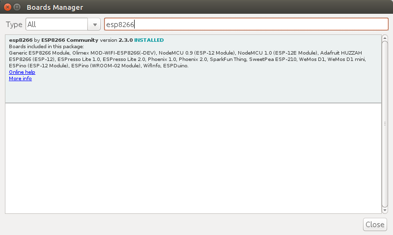

After installing the hardware package, the WeMos board appears in the Tools > Board:WeMos D1 R2 & Mini. Choose the correct board.

===== Library dependencies
Several libraries are used in this workshop. The xref:Arduino IDE pre-built portable edition[pre-built portal version] has all required dependencies already installed.

However, if you want to follow the path of the http://gameofthrones.wikia.com/wiki/Unsullied[unsullied eunuch soldiers], use this guide if you need help installing Arduino Libraries.

All the library dependencies are already downloaded with the working versions:

.Library dependencies
* Adafruit-GFX-Library v1.2.2 https://github.com/adafruit/Adafruit-GFX-Library/archive/1.2.2.zip
* Adafruit_SSD1306 fork for the Wemos OLED display 64x48 https://github.com/mcauser/Adafruit_SSD1306/tree/esp8266-64x48
* Time library, awesomely created by https://github.com/PaulStoffregen[PaulStoffregen] https://github.com/PaulStoffregen/Time
* WEMOS_SHT3x_Arduino_Library https://github.com/wemos/WEMOS_SHT3x_Arduino_Library
* Workshop-Logos available in link:lib/Workshop-Logos.zip[the repo] inside the _lib_ folder

[CAUTION]
====
If Arduino IDE kindly suggest you to update the libraries, you better don't do it. It will update the OLED display library and your programs will stop to work. This library is a fork that sets the correct height for the OLED display.
====

== Hello World Exercise
It wouldn't be a programming workshop without a *hello world* exercise!
Although this may seem rather basic, the aim is to test the board and explain the basic sections of an Arduino sketch.

=== Requirements
* WeMos ESP-8266-12S D1 mini v.2.3.0.
* USB type B mini cable.
* A world to be greeted.

=== Brief introduction to Arduino Sketch
An Arduino sketch is a program with extension *.ino* that will be compiled and used once it is uploaded to an Arduino-compatible board.
The sections of a sketch are:
****

void setup() { // <1>
  // initialize serial communications at 9600 bps
  
}

void loop() { // <2>
  // Put the code needed to print "Hello World" and after it, delay the execution of the next print
}
****
<1> The _setup_ block is executed at the very beginning. As its name indicates, it is used to _setup/configure_ the required components. Important: the _setup_ block is only executed once.
<2> The _loop_ section is executed continuously by the board after the setup section is executed.

For more information about Arduino, see the https://www.arduino.cc/en/Guide/Introduction[official Arduino documentation].

=== Hello world exercise 1
To achieve this honorable goal of writing a "Hello World" sketch, we will use a couple of built-in functions:

* The serial function is used to communicate through the serial port of the Arduino-based compatible board (also known as a UART or USART) and your computer: https://www.arduino.cc/reference/en/language/functions/communication/serial/begin/
* To handle the pace of each execution on the _loop_ block, we will need to throttle the gas pedal down a bit with: https://www.arduino.cc/reference/en/language/functions/time/delay/

[TIP]
====
To see what you have "printed" to the serial port, you will need to open Arduino's Serial Monitor window and select the Baud rate according to what you have configured in your actual sketch.
To open the Serial Monitor click on magnifying lens located at the top right corner of your sketch.

image::images/arduino-serial-monitor.png[Serial Momitor]
====

.Hello world steps

* Initialize the serial port communication to 9600 bauds
* Print to the serial port "Hello World." or "I will rule the world with this Wemos esp8266 board, huahuahuahuaaaaa!!!!"
* Keep the WeMos board still and rest 2 seconds before executing the _loop_ block again and print your text.

The exercise start file can be found at: Sketchbook -> iotworkshop-exercises -> 01-hello-world.ino

[NOTE]
====
The solution can be found at: Sketchbook -> iotworkshop-solutions -> 01-hello-world.ino
====

== LED Exercise

In this exercise, we will use the board's built-in LED, which we will turn on and off.
To handle the on-board LED, we will perform three actions:

. Blocking step
. Non-blocking step
. Fade-in and fade-out step

=== Requirements
* WeMos ESP-8266-12S D1 mini v.2.3.0
* USB type B mini cable

=== Blocking Exercise
My do we call it blocking first of all, because each time we call _delay()_ no other operation can be executed on the microcontroller.
To perform this step, we will use the following functions:

* pinMode is used to specify in which direction electrons should flow (inwards/outwards): https://www.arduino.cc/reference/en/language/functions/digital-io/pinmode/
* digitalWrite writes a digital signal to the specified pin: https://www.arduino.cc/reference/en/language/functions/digital-io/digitalwrite/
* delay: https://www.arduino.cc/reference/en/language/functions/time/delay/

.Blocking tasks

* Set up the pin that is connected with the on-board LED (a constant is globally available for the board BUILTIN_LED) as output in order to drive the current "outwards the board" to the LED.
* Start sending electrons to the LED's pin.
* Add a delay to see the transition from on to off.
* Stop sending electrons to the LED's pin.
* Add a delay to see the transition from off to on.

First, let's open the LED exercise start sketch at: Sketchbook -> iotworkshop-exercises -> 02-led.ino

[NOTE]
====
The solution can be found at: Sketchbook -> iotworkshop-solutions -> 02-led.ino
====

=== Non-blocking Exercise 3

The main difference in this step of the exercise is that instead of using the delay function, we will use the _millis()_ function to retrieve the actual milliseconds. This method is useful to avoid pausing the program when _delay_ is called, allowing us to handle interruptions signal for a more advance programming model that can mimic """"""""^1000^concurrent""""""""^1000^ code.

We will use the following functions:

* pinMode is used to specify in which direction electrons should flow, (inwards/outwards): https://www.arduino.cc/reference/en/language/functions/digital-io/pinmode/
* digitalWrite writes a digital signal to the specified pin: https://www.arduino.cc/reference/en/language/functions/digital-io/digitalwrite/
* millis to get the actual milliseconds count since the board started: https://www.arduino.cc/reference/en/language/functions/time/millis/

.Non-blocking tasks

* Configure the pin that is connected with the on-board LED (a constant is globally available for the board BUILTIN_LED) as output in order to drive the current "outwards the board" to the LED.
* Instead of calling delay, we will get the current _millis()_ and compare it to the last time we toggled the state of the LED.
* If the time passed is greater that a specified _interval_ (say 1000 milliseconds), toggle the LED state.

Firstly, let's open the LED exercise start sketch at: Sketchbook -> iotworkshop-exercises -> 03-led-non-blocking.ino

[NOTE]
====
The solution can be found at: Sketchbook -> iotworkshop-solutions -> 03-led-non-blocking.ino
====

=== LED fading Exercise 4

In this step of the exercse, we will write an analog signal instead of a digital one to regulate the voltage that the LED is receiving in order to make it glow brighter or darker.

For this step, we will use the following functions:

* pinMode is used to specify in which direction should electrons flow, inwards outwards: https://www.arduino.cc/reference/en/language/functions/digital-io/pinmode/
* analogWrite writes an analog signal with a specific voltage to the specified pin: https://www.arduino.cc/reference/en/language/functions/digital-io/digitalwrite/
* delay: https://www.arduino.cc/reference/en/language/functions/time/delay/

[NOTE]
====
analogWrite(pin, value) enables software PWM on the given pin. PWM may be used on pins 0 to 16. Call analogWrite(pin, 0) to disable PWM on the pin. The value may be in range from 0 to PWMRANGE, which is equal to 1023 by default. PWM range may be changed by calling analogWriteRange(new_range).

PWM frequency is 1kHz by default. Call analogWriteFreq(new_frequency) to change the frequency.
====

.Fading tasks

* Configure the pin that is connected with the on-board LED (a constant is globally available for the board BUILTIN_LED) as output in order to drive the current "outwards the board" to the LED.
* Set a brightness of 0.
* In each _loop_ execution:
Write analogically the brightness to the LED.
* Increment or Decrement the brightness by a _fade Amount_
* Delay

Now, let's open the LED exercise start sketch at: Sketchbook -> iotworkshop-exercises -> 04-led-fading.ino

[NOTE]
====
The solution can be found at: Sketchbook -> iotworkshop-solutions -> 04-led-fading.ino
====

== Environmental Sensor Exercise 5
In this exercise, we will connect our WeMos ESP8266-12S D1 mini with the WeMos SHT30 Shield v1.0.0 using the <<I^2^C Protocol>>. Once they are connected, we will read the SHT30 Shield's measured temperature and humidity and print it to the serial port.

=== Requirements
* WeMos ESP-8266-12S D1 mini v.2.3.0.
* WeMos SHT30 Shield v1.0.0 I^2^C.
* WEMOS_SHT3x_Arduino_Library installed.
* An environment to be measured. XDDDD

=== Tasks
* Check that library is included. If it is not, we can include it manually by typing `#include <WEMOS_SHT3X.h>` or by going to _Sketch -> Include Library -> WEMOS_SHT3X_. If you don't see this entry, it means that you followed the path of the http://gameofthrones.wikia.com/wiki/Unsullied[unsullied eunuch soldiers] and forgot to install some libraries into your Arduino IDE.
* To use the SHT3X shield, declare `SHT3X sht30(0x45);` a global variable to the sensor initializing it to the current configured _I^2^C address_ *0x45*. 

[NOTE]
====
The I^2^C address can be changed to an alternative one directly on the board by bridging (soldering) the other address.
[TODO add photo to the boards I^2^C address]
====
* Set up the serial port.
* Test if the board is ready with `get()`. It returns 0 if there is no error; otherwise it prints an error.
* Print the temperature in Celsius and Fahrenheit. Don't go crazy, no conversion is needed! Use `cTemp` and `fTemp` members from `sht30` respectively.
* Delay some milliseconds.

To start, let's open the Environmental sensor exercise start sketch at: Sketchbook -> iotworkshop-exercises -> 05-environmental-sensor.ino

[NOTE]
====
The solution can be found at: Sketchbook -> iotworkshop-solutions -> 05-environmental-sensor.ino
====

== Display Exercise 6
In this exercise, we will use an existing example provided by Adafruit to test the display and to learn a bit about the possibilities of the graphical library while playing around with the code a bit.

=== Requirements
* WeMos ESP-8266-12S D1 mini v.2.3.0
* WeMos OLED Shield v1.1.0

=== Tasks

* Connect the display.
* Flash the example.
* Go through the code, change it to print your name.

To begin, let's open the display exercise start sketch at: Sketchbook -> iotworkshop-exercises -> 06-ole-sample.ino

== Temperature, Humidity Monitoring & Display Exercise
This exercise will be split in 2 sections. In the first, we will display the current temperature and humidity on the display. In the second, we will push the data to the Adafruit IoT platform or to our own Oracle Cloud (or another cloud provider) deployed as Docker Elasticsearch Kibana overengineered environmental monitoring platform.

[NOTE]
====
As once a developer replied to the question -
__Why are you over-engineering the solution, apply K.I.S.S?__ - :

image::images/kiss.jpeg[KISS]
__Answer__:

BECAUSE I CAN!
====

=== Requirements
* WeMos ESP-8266-12S D1 mini v.2.3.0
* WeMos OLED Shield v1.1.0
* WeMos SHT30 Shield v1.0.0 I^2^C
* Dual Base

=== Temperature, humidity display Exercise 7
In this exercise, instead of printing the gathered sensor data to the standard output, we will draw it on the display.

.Libraries used:
* Adafruit-GFX-Library v1.2.2: Graphics library.
* Adafruit_SSD1306: Display library.
* WEMOS_SHT3x_Arduino_Library: SHT3x environmental sensor shield.
* Workshop-Logos: Draw fancy logos.

=== Tasks

* Include all needed libraries. In case of doubt, go back and read the how to add a library section.
* Configure the OLED display.
* Configure the SHT30 sensor.
* Set up the serial port, in case we need to debug some data.
* Initialize the display `display.begin(SSD1306_SWITCHCAPVCC, 0x3C);` to the expected I^2^C address.
* For each loop iteration:
** Clear the display buffer:
*** clear the display.
*** Set the text size to `1`.
*** Set the display cursor to position `0.0`.
*** Set text color to `WHITE`.
** When the sensor data is available, draw the sensor information to the display.

First, let's open the Environmental sensor exercise start sketch at: Sketchbook -> iotworkshop-exercises -> 07-temp-humidity-display.ino

[NOTE]
====
The solution can be found at: Sketchbook -> iotworkshop-solutions -> 07-temp-humidity-display.ino
====

=== Temperature, humidity monitoring Exercice
In this exercise, we will send the gathered data to a persistent data store instead of just displaying it. But to monitor events/facts, we need to know when they happened, which means getting a timemark for each collected data point. Once we have the timestamp of each sensor measurement, we will send it to our monitoring platform, either:

* Elasticsearch and Kibana, deployed as a container in Oracle Cloud.
* Adafruit IO.

Sadly, the WeMos ESP-8266-12S D1 mini v.2.3.0 doesn't have a clock. Well, that's not totally true: to be precise, it does not have a *wall clock.* Instead it has a *monotomic* clock that can, very precisely, measure the elapsed time between time observations without being affected by leap seconds as *wall clocks* are.

So how can we precisely know when an observed sensor data was taken, if we don't have a wall clock? Well, we can do a small trick. We can take advantage of the Arduino _millis()_ function that returns the number of milliseconds since the current Arduino program started, and combine it with an observed *wall clock*. In this case, we will use the *NTP* protocol, which stands for *Network Time Protocol*.

Creating network requests to get the current time for each gathered sensor metric will introduce a huge latency and a waste of precious resources. Instead, we can request the current *wall clock* from a _Time server_ at the beginning of our program using *NTP*, and then keep it updated locally by incrementing the elapsed time observed in every loop, for instance.

To request the current time from a _Time Server_, we will use the awesome library created by https://github.com/PaulStoffregen/Time[PaulStoffregen], which lets you retrieve the current time using:

* NTP
* Real Time Clock
* The GPS position information, which also includes the current time.

.Libraries used:
* Adafruit-GFX-Library v1.2.2: Graphics library.
* Adafruit_SSD1306: Display library.
* WEMOS_SHT3x_Arduino_Library: SHT3x environmental sensor shield.
* ESP8266WiFi: Connect to the Wi-Fi.
* ESP8266HTTPClient: Make the HTTP request.
* WiFiUdp: Receive UPD packages with the time response from the _Time Server_.
* Time: Get the current time using NTP.
* Workshop-Logos: Draw fancy logos.

=== Temperature, humidity display Exercise 8 tasks
The current exercise will be based on the solution of the last exercise and will also include the boilerplate code to get the current *NTP* time.

The tasks needed to complete the exercise are:

* Include all required libraries. In case of doubt, go back and read the how to add a library section.
* Configure the Wi-Fi.
* Connect to the Wi-Fi.
* Sync the current time using the provide function _syncTimeFromNTP()_.
* For each loop iteration:
** Clear the display buffer.
** Print sensor data to the OLED display.
** If the Wi-Fi connection is still available AND the current time is still in sync, send the sensor data:
*** Create the HttpClient.
*** Specify the request destination with _begin()_
*** Add a _Content-Type_ header to the request with a value of _application/json_.
*** Get the current time with the exercise provided function _getCurrentTimestamp()_
*** Build the sensor data message:

----
    {
        "sensorID": ,
        "temperatureCelcius": ,
        "relativeHumidity": , 
        "timestamp": 
    }
----

*** Post the message.
*** Finalize the _http client_ by calling _end()_

[IMPORTANT]
====
Each device should have its own unique sensorID, please use it.
====

To start with, let's open the Environmental sensor exercise start sketch at: Sketchbook -> iotworkshop-exercises -> 08-temp-humidity-monitoring.ino

[TIP]
====
If want to get some inspiration go to Examples -> ESP8266HTTPClient, and take and checkout some of the examples go know how to use the library.
====

[NOTE]
====
The solution can be found at: Sketchbook -> iotworkshop-solutions -> 08-temp-humidity-monitoring.ino
====

=== Adafruit IO temperature, humidity, display Exercise 9 tasks
The current exercise will be based on the solution of the last exercise and will also include the boilerplate code to get the current *NTP* time, although it is not really needed to push the data.

In order to use the Adafruit IO service, we will need to:

* Create an account, it's free.
* Create a feed group that will help the different feeds (individual sensor metrics).
* Create a feed for _temperatute_ and for _humidity_ adding each of them to the previously created group.

The tasks needed to complete the exercise are:

* Include all required libraries. In case of doubt, go back and read the how to add a library section.
* Configure the Wi-Fi.
* Connect to the Wi-Fi.
* Sync the current time using the provide function _syncTimeFromNTP()_.
* For each loop iteration:
** Clear the display buffer.
** Print sensor data to the OLED display.
** If the Wi-Fi connection is still available, send the sensor data:
*** Create the HttpClient.
*** Specify the request destination with _begin()_
*** Add the Adafruit IO required key header _x-aio-key_ to the request with your personal Adafruit IO key.
*** Add a _Content-Type_ header to the request with a value of _application/json_.
*** The current timestamp is not mandatory as, in advance, the current timestamp of the Adafruit service UTC will be used.
*** Build the sensor data message:

----
    {
    "feeds":[
    		{
    			"key": "temperature",
    			"value": ""
    		},{
    			"key": "humidity",
    			"value": ""
    		}
    	]
    }
----
    
*** Post the message.
*** Finalize the _http client_ by calling _end()_

Let's open the Environmental sensor exercise start sketch at: Sketchbook -> iotworkshop-exercises -> 09-temp-humidity-monitoring-adafruit-io.ino

[NOTE]
====
The solution can be found at: Sketchbook -> iotworkshop-solutions -> 09-temp-humidity-monitoring-adafruit-io.ino
====

= Oracle Cloud Services
Oracle Cloud Services offers several solutions to ease the cloud transition for individuals and companies. In this section, we will focus on the Oracle Cloud Container Services and use them to deploy our monitoring solution.

First, we need to create an account to use Oracle Cloud Services. Fortunately, they offer a $300 voucher to try them out.

Once we have an account ready, we can login and move on to creating our Oracle Container Cloud Service.

== Create the Oracle Container Cloud Service

To get started with the Oracle Container Cloud Service, you first define an OCCS service that represents a set of hosts used for OCCS. A service always consists of a manager node and one or more worker nodes.

The manager node orchestrates the deployment of containers to the worker nodes. The worker nodes host the containers or stacks of containers. The set of worker nodes for a service can later be further subdivided into pools that build a resource group.

Every configured OCCS service has its own admin user and password. To set up an OCCS service, you define its service name and either create a new SSH key or specify an existing one. Using this SSH key, you can connect to the service from the command-line.

To create an Oracle Container Cloud Service, it is as easy as navigating to the menu and choosing the Container Classic option, then click Create Service:

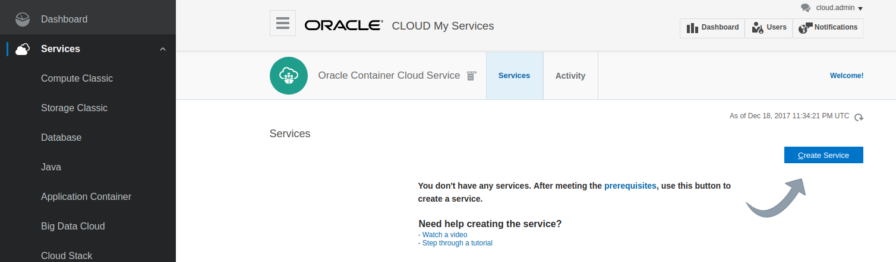

After clicking, you will need to complete the form, providing the required information such as:

* Service name
* Email address
* SSH Key to access the service
* Administration credentials like username and password
* And specifications of your worker nodes:
    * Machine type
    * Number of instances
    * Disc size per machine
    
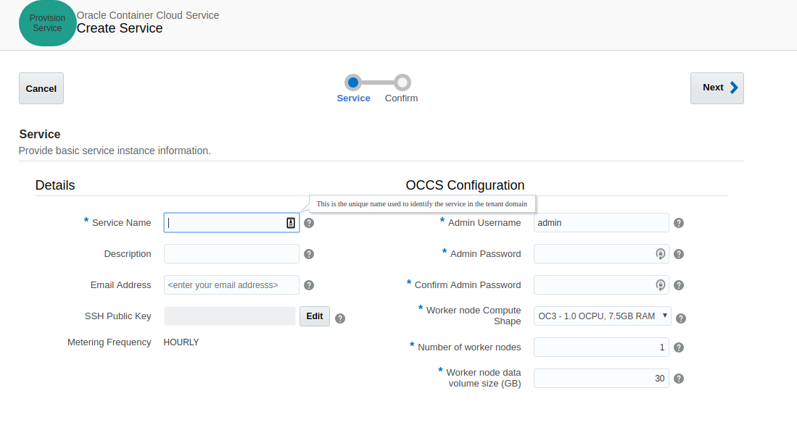

After providing all this, your service will be scheduled to be created:

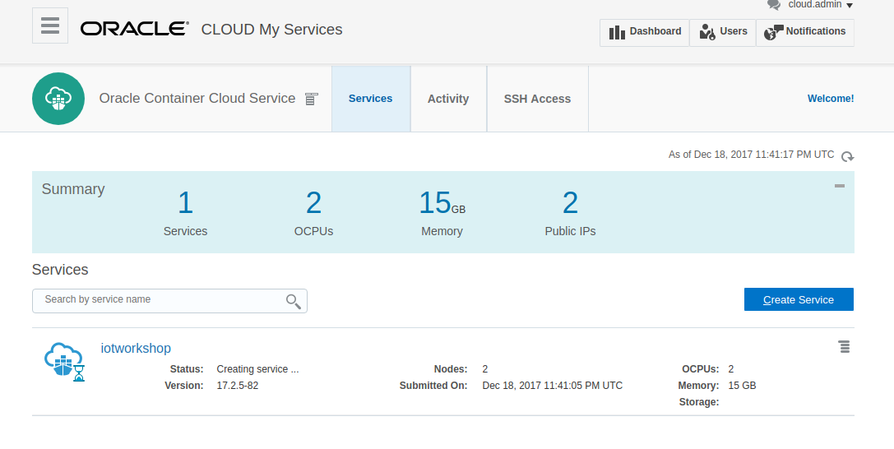

Once the Oracle Container Cloud Service is created, click on the Service menu to access the container console:

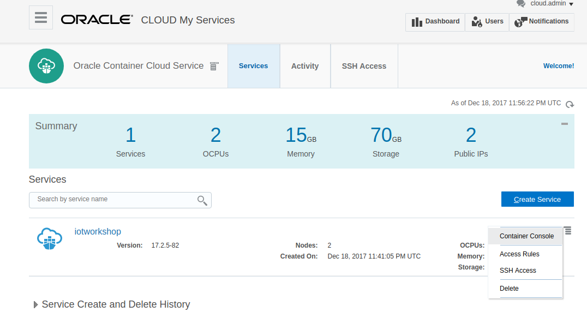

And you will access the container service dashboard.

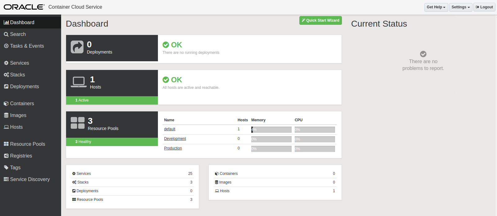

== Create and Deploy Monitor Containers
For this workshop, docker images have already been created for Elasticsearch and Kibana. Both Dockerfile definitions can be found at:
[tree,file="images/docker-tree-view.png"]
--
docker
`--elasticsearch-kibana
   |--elasticsearch
   |  |--Dockerfile
   |  `--config
   |     `--elasticsearch.yml
   |--README.md
   |--docker-compose.yml
   |--kibana
   |  |--Dockerfile
   |  `--config
   |     `--kibana.yml
   `--kibana-export.json
--

[WARNING]
====
Those images are based on the official elastic images. The only difference is that they have X-Pack security disabled, to make it easier to publish and consume data from Elasticsearch and Kibana.
====

The images that will be used can be found in Docker hub:

* Elasticsearch: http://hub.docker.com/r/morfeo8marc/docker-elasticsearch[Docker image for Elasticsearch]
* Kibana: http://hub.docker.com/r/morfeo8marc/docker-kibana[Docker image for kibana]

Those images will be pulled by the configuration of the OCCS repositories.

=== Repositories
OCCS can tag docker images and push them to a repository for you. Images can be pushed to any repository in any registry, not only the registry from which they were pulled.

The docker hub is preconfigured, but you can add registries. For example, those that you run locally within your company.

== Create the Required Services
In OCCS, you have already pre-created services like Golang, Alpine, etc. that are ready to be deployed.

We will need to create our own services, one for Elasticsearch and another for Kibana.

=== Create Elasticsearch service
Create a new service by clicking on _New Service_, and provide the following information either by clicking, or by editing the yaml:

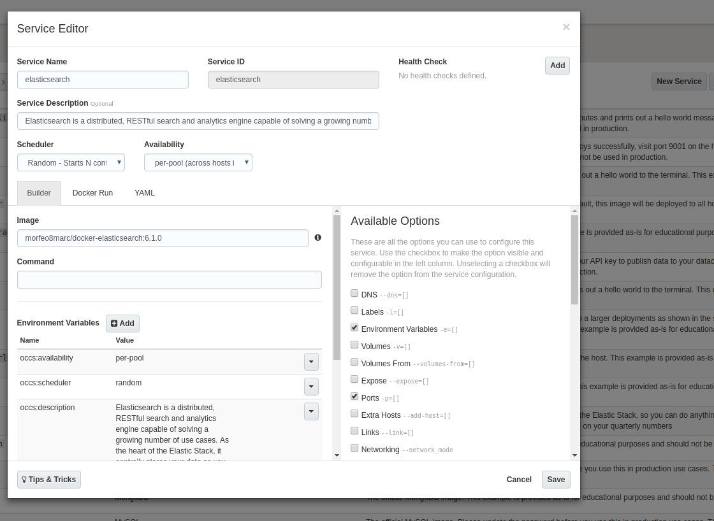

----
version: 2
services:
  elasticsearch:
    image: 'morfeo8marc/docker-elasticsearch:6.1.0'
    environment:
      - 'occs:availability=per-pool'
      - 'occs:scheduler=random'
      - >-
        occs:description=Elasticsearch is a distributed, RESTful search and
        analytics engine capable of solving a growing number of use cases. As
        the heart of the Elastic Stack, it centrally stores your data so you can
        discover the expected and uncover the unexpected
    ports:
      - '9200:9200/tcp'
      - '9300:9300/tcp'
----

=== Create Kibana service
Create a new service by clicking on _New Service_, and provide the following information either by clicking, or by editing the yaml:

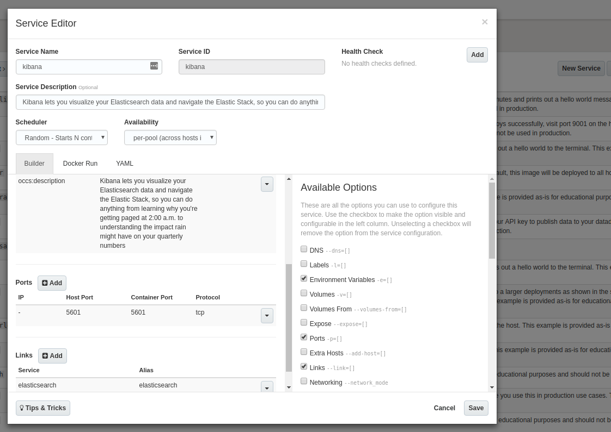

----
version: 2
services:
  kibana:
    image: 'morfeo8marc/docker-kibana:6.1.0'
    environment:
      - 'occs:availability=per-pool'
      - 'occs:scheduler=random'
      - >-
        occs:description=Kibana lets you visualize your Elasticsearch data and
        navigate the Elastic Stack, so you can do anything from learning why
        you're getting paged at 2:00 a.m. to understanding the impact rain might
        have on your quarterly numbers
    ports:
      - '5601:5601/tcp'
    links:
      - 'elasticsearch:elasticsearch'
----

== Create a Stack
A stack is a combination of services that need to be deployed together, like a web app and its database. These stacks can later be reused to deploy several instances of them, if properly configured (like taking care of exported ports, volumes path, ...).

In order to create our Elasticsearch Kibana stack, it is as easy as going to Stack and click on New Stack and drag and drop the desired services that we want to be grouped as a stack.

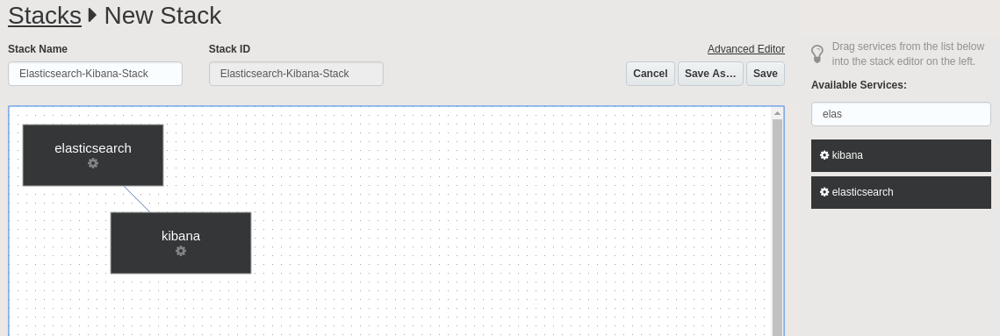

[NOTE]
====
There is a line between those two services, because we defined a link from the Kibana service to the ElasticSearch service. By default, Kibana is configured to query Elasticsearch at *http://elasticsearch:9200*
====

Once the new stack is saved, deploy it.

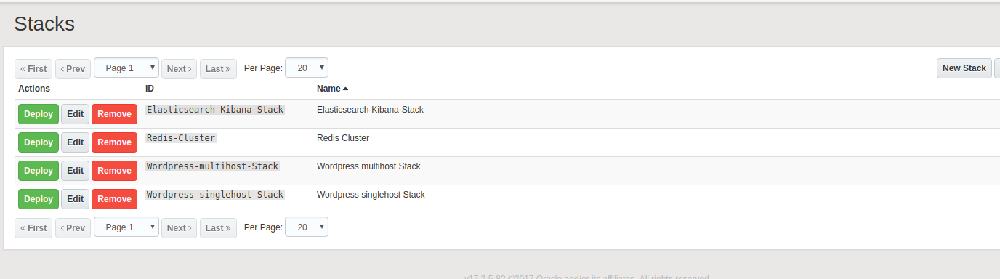

== Deployment
Once we click on deploy, OCCS will start to allocate our stack by:

* Pulling the image.
* Creating each container for each defined service in the stack, according to the provided scheduling Policy and availability configuration.

Once it is done, it will look like:

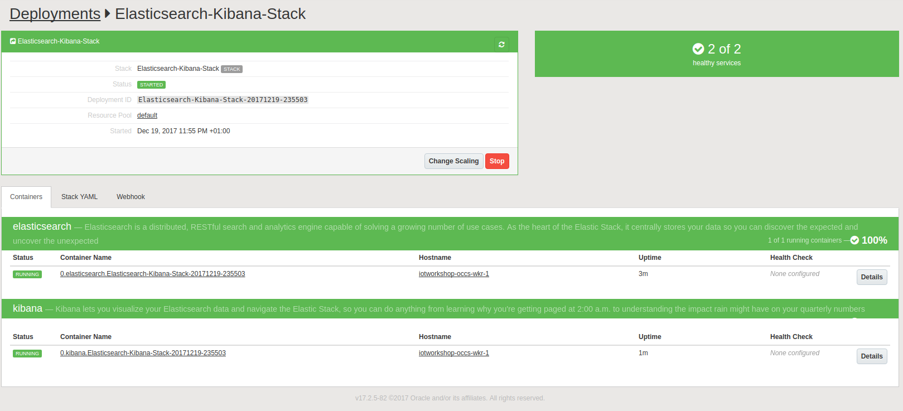

Now it's time to access our monitoring services. Click on the host for each deployed service in order to get the public facing IP:

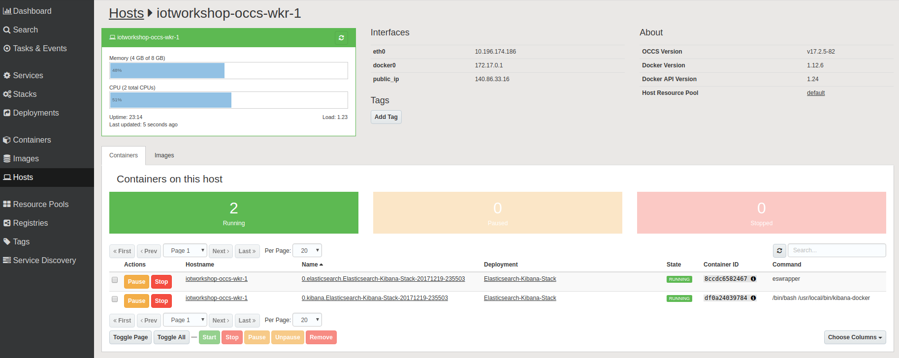

=== Check deployments
To check Elasticsearch, just go to http://<host-ip>:9200.

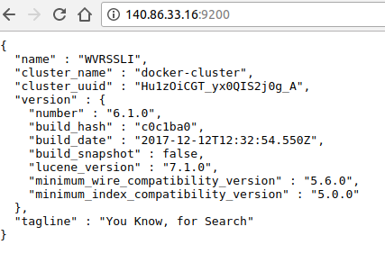

To check Kibana just go to http://<host-ip>:5601

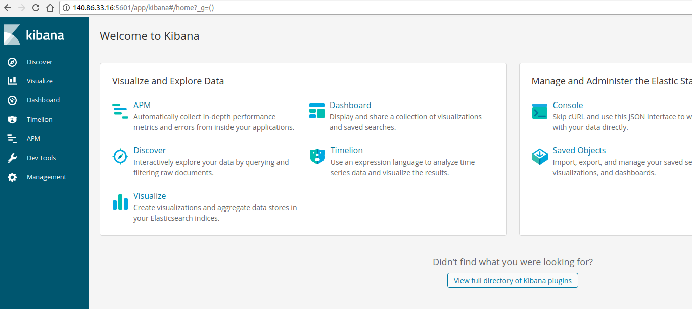

That's it, we have deployed our services.

== Create Monitoring Dashboards with Kibana
First of all, create the index mappings:

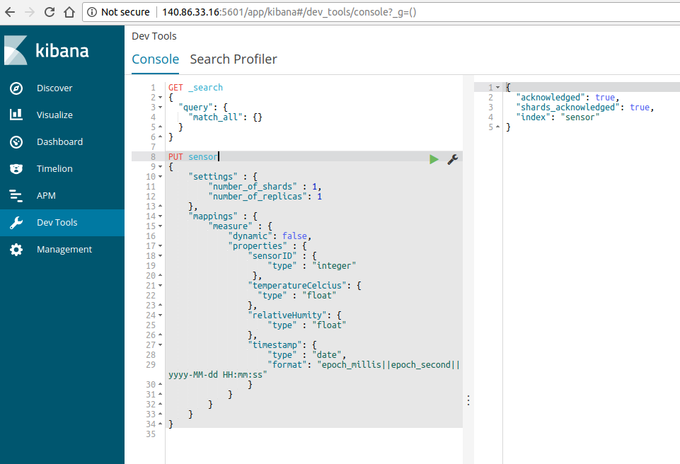

And start pushing data to the new created index.

After creating the index, let's configure Kibana to use our index:

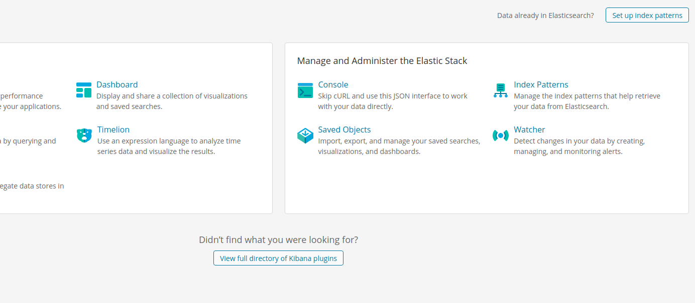

Set our created index name:

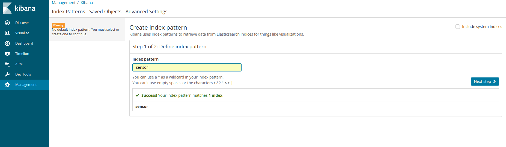

Set the property that will hold the sensor measurement timestamp in order to create time based visualizations.

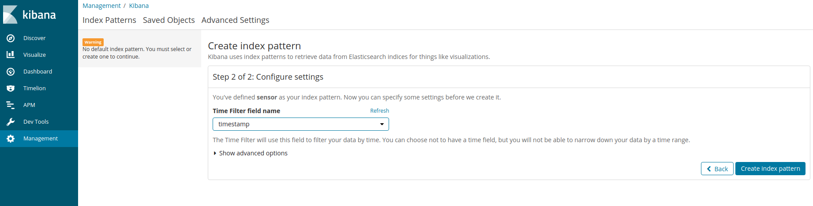

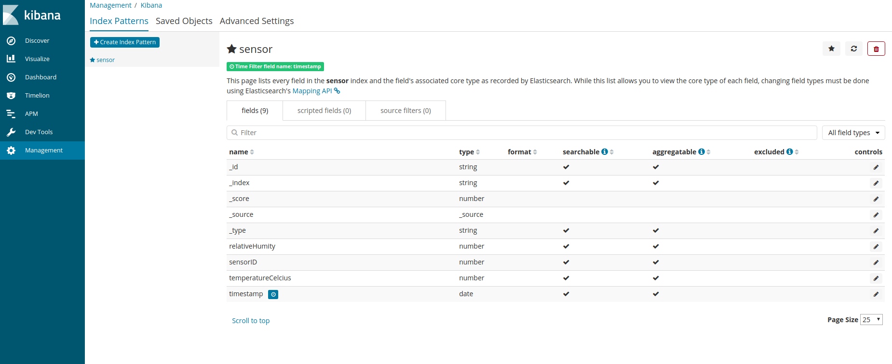

Once it is configured, we can discover our pushed data:
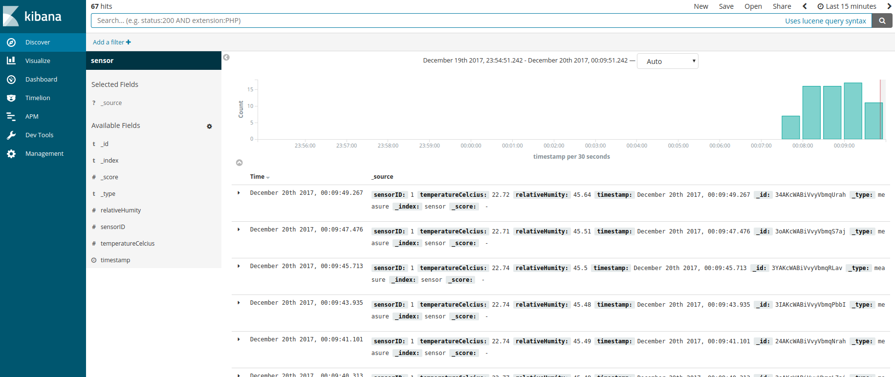

And finally, we can create a visualizations and a dashboard:

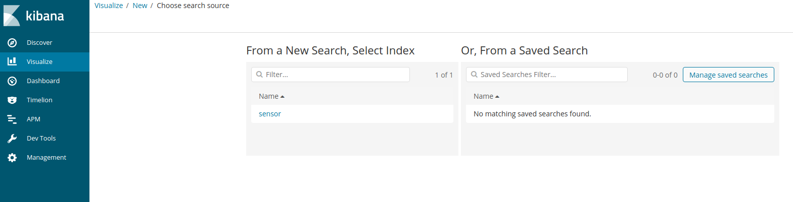
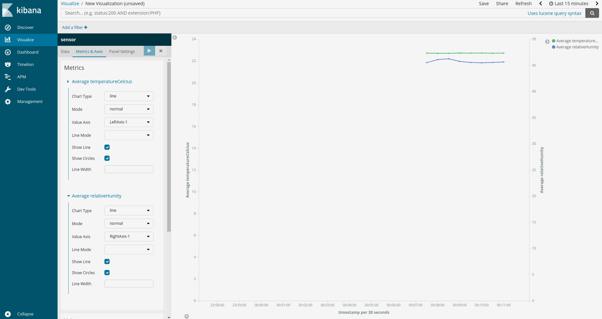
image::images/oracle-cloud/services/kibana/09-ibana-create-dashboard.png[]

= I^2^C Protocol

I²C (Inter-Integrated Circuit), pronounced I-squared-C, is a multi-master, multi-slave, packet switched, single-ended, serial computer bus invented by Philips Semiconductor (now NXP Semiconductors). It is typically used for attaching lower-speed peripheral ICs to processors and microcontrollers in short-distance, intra-board communication. Alternatively, I²C is spelled I2C (pronounced I-two-C) or IIC (pronounced I-I-C).

Since October 10, 2006, no licensing fees are required to implement the I²C protocol. However, fees are required to obtain I²C slave addresses allocated by NXP.

Several competitors, such as Siemens AG (later Infineon Technologies AG, now Intel mobile communications), NEC, Texas Instruments, STMicroelectronics (formerly SGS-Thomson), Motorola (later Freescale, now merged with NXP), Nordic Semiconductor and Intersil, have introduced compatible I²C products to the market since the mid-1990s.

SMBus, defined by Intel in 1995, is a subset of I²C, defining a stricter usage. One purpose of SMBus is to promote robustness and interoperability. Accordingly, modern I²C systems incorporate some policies and rules from SMBus, sometimes supporting both I²C and SMBus, requiring only minimal reconfiguration either by commanding or output pin use.